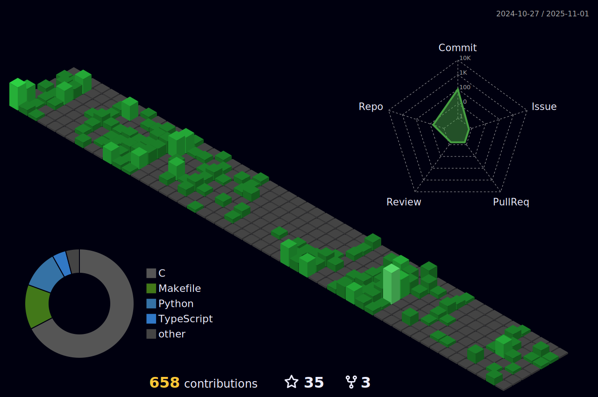

<h1 align="left">Hey 👋 What's up?</h1>

I'm an avid self-learner and passionate about IT. I recently graduated from [42HN](https://www.42heilbronn.de/en/) and currently pursuing mastery at 42 (RNCP 7) in 'Network Information & Systems Architecture'

<!-- I have a variety of interests:

   * 🌎  Travelling
   * 👨  Personal Development
   * 🏋️‍♂️  Calisthenics
   * 📚  Books 
   * ♕   Chess -->

   - ✨ Been creating bugs since 2019.
   - 👯 I’m looking to collaborate on challenging projects.

... always learning something new 🤓

<h2 align="left">Languages & Markups:</h2>

<h2 align="left">Tools & Platforms:</h2>

<h2 align="left">Frameworks & Libraries:</h2>

<h2 align="left">DevOps & Cloud:</h2>

<h2 align="left">Data & Messaging:</h2>

###

---

	

|  |  |
|:-:|:-:|
	

	
	
	

---

 - 📫 How to reach me:
###

  
  
  
  
  
  
  
  

 

	
	 * 
	

